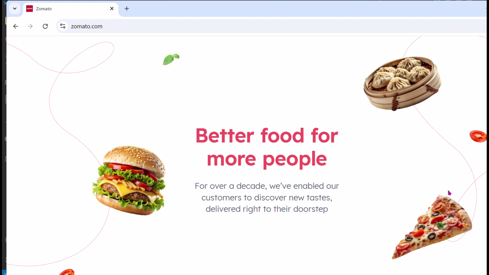
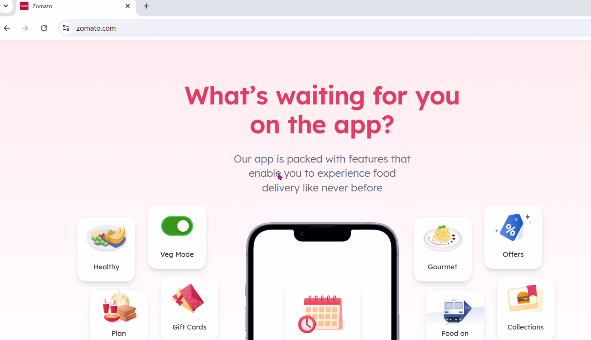
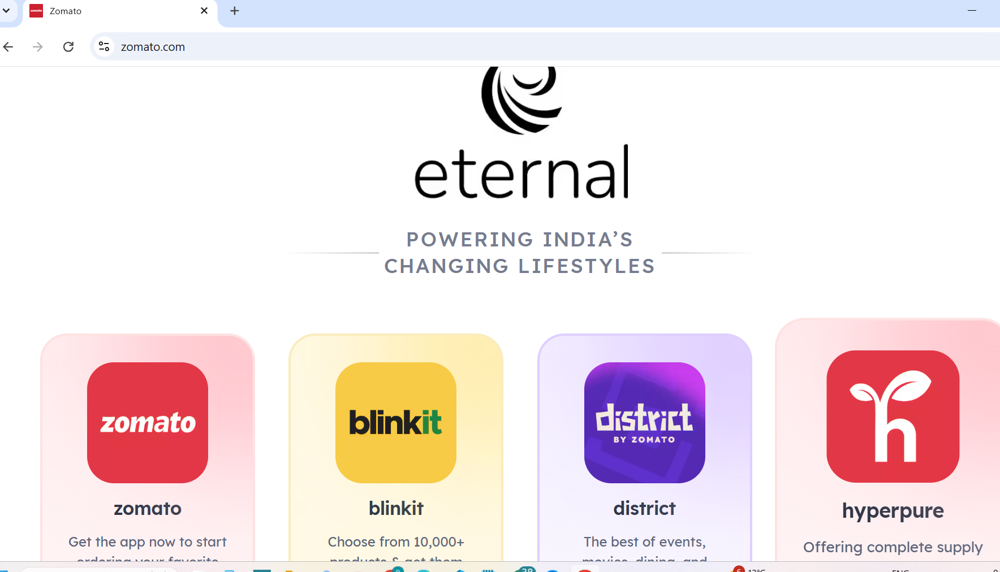
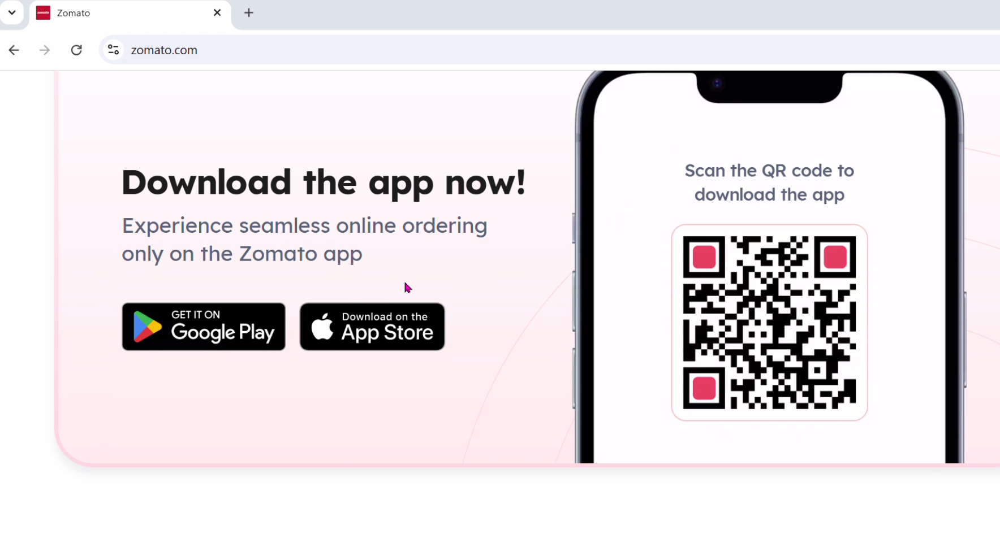

# WEB SENSE – ZOMATO SEMI-AUTONOMOUS AGENT

## Overview
This project is a semi-autonomous web interaction agent that explores Zomato, interacts with the site dynamically, observes the environment, and generates UX insights. The agent uses AI reasoning, memory, and smart browser automation.

---

## Features
- Dynamic search and navigation of Zomato pages  
- Smart selectors for handling UI changes  
- UX analysis and reporting  
- Persistent memory across runs  
- Asynchronous, non-blocking browser operations  

## 📸 Project Execution Proof

### 🟢 Step 1 – Zomato Homepage Loaded


### 🟢 Step 2 – Automated Food Search


### 🟢 Step 3 – Restaurant Page Opened Automatically


### 🟢 Step 4 – UX Analysis Generated by Agent


### 🟢 Step 5 – GitHub Repository Proof



---

## Architecture
websense/
├─ agent/
│ ├─ runner.py # Orchestrates agent workflow
│ ├─ reasoner.py # AI-like decision-making
│ ├─ observer.py # Observes page DOM/state
│ ├─ insight.py # UX analysis engine
│ └─ memory.py # Persistent memory across runs
├─ tools/
│ └─ browser.py # Playwright-based browser automation
├─ logs/ # Memory and run logs
├─ prompts/ # (Optional) AI prompt templates
├─ tests/ # Unit tests
├─ main.py # Entry point
├─ requirements.txt
└─ README.md


#yaml

---

## How It Works
1. Opens Zomato homepage asynchronously  
2. Searches for food items dynamically using smart selectors  
3. Clicks the first restaurant result  
4. Observes page and generates UX insights  
5. Saves observations to persistent memory (`logs/memory.json`)  
6. Closes browser cleanly  

---

## Key Design Decisions
- **Smart Selectors:** Handles UI changes, avoiding hard-coded selectors  
- **Memory:** Agent remembers previous observations across runs  
- **Async-first:** Non-blocking browser actions using Playwright  
- **Error Handling:** UX engine detects possible errors and logs them  

---

## Setup & Run
```bash
# Clone repo
git clone <your-repo-url>
cd websense

# Create virtual environment
python -m venv venv
.\venv\Scripts\activate   # Windows
# or source venv/bin/activate   # Linux/Mac

# Install dependencies
pip install -r requirements.txt
python -m playwright install

# Run agent
python main.py
